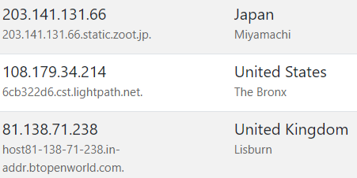
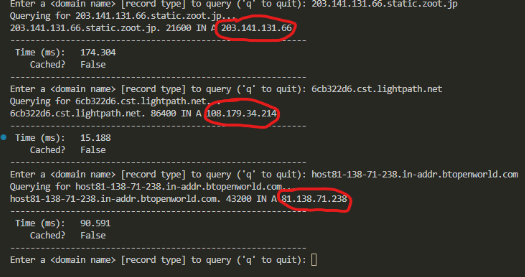

## Introduction
Domain Name System (DNS) translates human-readable domain names into IP
addresses. In this project, we created a simple DNS resolver using Python. Our
fundamental goals were to support recursive and iterative querying with caching.
We also planned to implement support for different record types and performance
optimization with concurrent queries. We ended up minimally relying on the
`dnspython` library to serialize and deserialize requests and responses.

## Design/Implementation

#### Overall
Our `main` function parses user input for a domain and a record type. If no
flags were passed into the command line, the resolver defaults to
recursive queries with the `recursiveQuery` function. If the
`--iterative` flag is passed in, `iterativeQuery` is called. To convert a domain
into a query, we use the `dns.message.make_query` function. To then serialize it
for sending over a UDP socket, we use `dns.message.Message.to_wire` method.

#### Global variables
- `lock`: a `threading.Lock` to ensure only one thread for `recursiveQuery`
  returns a result
- `root_servers`: a hard-coded list of all 13 root servers
- `cache`: a `TTLItemCache`, which inherits from `TTLCache`, allowing for each
  item to have its own TTL
- `rdtypes`: a dictionary mapping from record types to their equivalent in the
  `dnspython` library

#### `recursiveQuery`
*Takes in a domain, list of DNS servers, and a record type. Returns address (or
error message) and a boolean representing whether the result was cached.*

If the domain is in the cache, the cached result is returned. Otherwise, we rely
on multithreading to query multiple DNS servers. Concretely, we create a thread 
for each DNS server passed in. Each thread runs `dnsServerThread`, which queries
the given DNS server on the DNS port (53) via a UDP socket for an answer. The 
first thread that receives an answer acquires the lock and stores the answer in
the cache with the TTL from the answer. The original `recursiveQuery` thread
simply waits until one of its threads sets an answer and returns. If no threads
were able to receive a response, "Unable to find domain" is returned.

#### `iterativeQuery`
*Takes in a domain and a record type. Returns address (or error message),
a boolean representing whether the result was cached, and the path that the
iterative algorithm took.*

If the domain is in the cache, the cached result is returned. Otherwise, the
iterative algorithm proceeds. The first root server is queried via a UDP socket.
When we receive a response, if an additional section exists, we continue to
iterate with an address from the additional section. Otherwise, we continue with
a nameserver from the authority section. If a particular root server is not able
to eventually resolve a domain, we try a different root server. If we ultimately
receive an answer, we store it in the cache with the answer's TTL and return
the address (or "Unable to find domain") and the path taken.

## Discussion/Results
We were able to successfully implement our goal of creating a simple DNS resolver. To test the correctness of our resolver, we used https://public-dns.info/ for several domain names to test our resolver on, and compare our result with the IP listed and check it matches.

The first image shows three different domain names and the corresponding IP and the second shows our resolver taking in these domain names. The returned IP addresses are circled in red, and we can see that these match. To test the correctness of the path of the iterative method, we manually tested some domain names and checked if the given path was valid – you can see this in our demo video with google.com.

The second image also shows that the querying time is fast (using the recursive method). This indicates that our multithreading works properly and the reason for any delay is purely local setup/RTT based, and not the resolver algorithm itself. In addition, the demo video shows (using Wireshark) that the packets we send are properly formatted, along with the fact that our socket properly receives, so every step in the process seems to run as intended.

The bulk of this project was fairly straightforward: in particular, the dnspython library being well documented allowed us to integrate it into our project with little trouble. Aside from implementing the multithreading logic (which was mostly finding what we needed from the threading library), we also played around with some of the parameters to see which would get us the best performance. One example is the amount of time we should wait to get a response from one of our threads before deciding the domain can’t be found: if this is too long, then we are just wasting time if the domain name can’t be found, but it can’t be too short or else it might cut off a thread that eventually returns a response. Another example is varying the number of servers to query in the recursive method to ensure there isn’t a timeout with high probability, but also to minimize the number of threads actually needed.

## Conclusions/Future Work
This project allowed us to become more familiar with how DNS resolvers work and gain some appreciation for the scale on which this happens in practice. If we had the time to continue working on this, it would be nice to allow the user to actually read the parts of the cache based on certain filters and parameters, instead of having to repeatedly query one domain name at a time. Another slight optimization would be to find the best combination of servers for the recursive method to use that would optimize performance, rather than taking a random subset of them. A final idea would be to remove our dependence on the `dnspython` library so we can make the whole process entirely ours.

All in all, we are happy with what we have, especially given the limited time and finals happening this week. Working on this project (and class!) was very enjoyable, and we are glad we made the right project choice :)